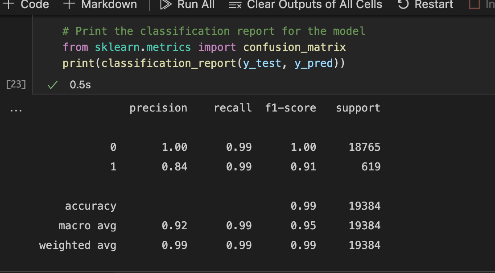

# Module 12 Challenge

## Overview of the Analysis

*  The purpose of this challenge is to develop two logistic regression models capable of predicting healthy and high-risk loans. The first model uses the original historical loan data and the second model applies RandomOverSampler to better train the model with high-risk loan data. The two models are compared in the following section.

## Results

* Machine Learning Model 1:
  * The first model had accuracy, precision, and recall scores of 99%, 92%, and 99%, respectively.

  

* Machine Learning Model 2:
  * The second model had accuracy, precision, and recall scores of 99%, 92%, and 99%, respectively. 
  

## Summary

* Both models are nearly identical. The precision is greater for healthy loans in the second model. Both models have an unweighted precision and recall average of 95%.
* It is more important to predict the high risk loans.

